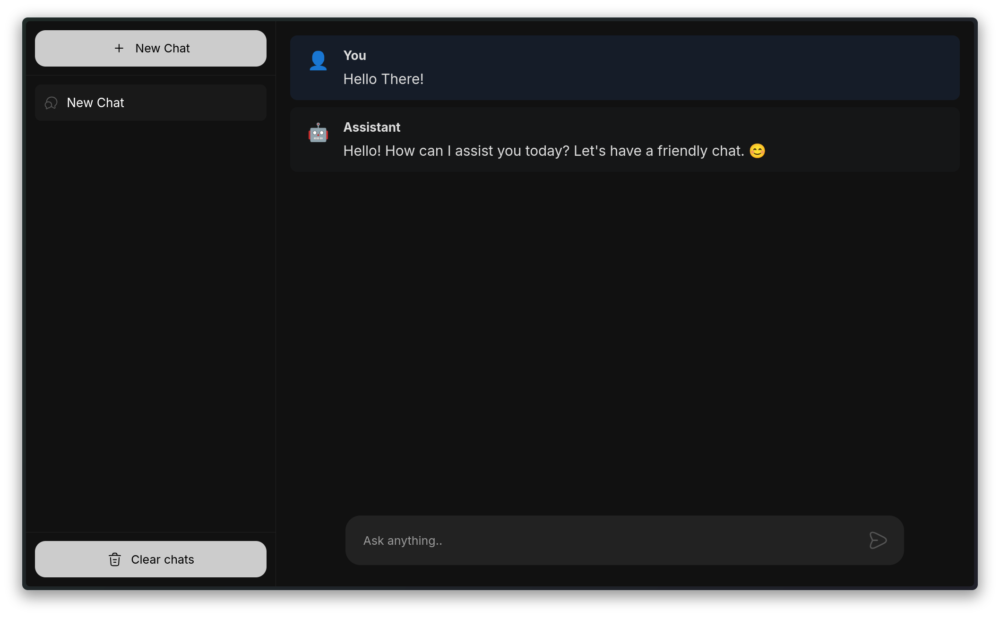

# 🤖 React Chat GPT Wrapper



> 💫 A beautiful and modern React-based chat interface for interacting with GPT models, built with love and cutting-edge technologies!

## 🚀 What's This About?

Welcome to the **React Chat GPT Wrapper** – your gateway to seamless AI conversations! This project provides a sleek, user-friendly interface that wraps around GPT models, making AI interactions as smooth as butter. Whether you're brainstorming ideas, getting coding help, or just having a friendly chat with AI, this app has got you covered!

## ✨ Features That'll Make You Smile

- 🎨 **Beautiful UI/UX** - Clean, modern design that's easy on the eyes
- 💬 **Multiple Chat Sessions** - Organize your conversations like a pro
- 🔄 **Real-time Messaging** - Lightning-fast responses that feel natural
- 📱 **Responsive Design** - Looks amazing on any device
- 🎯 **TypeScript Powered** - Rock-solid type safety for better development
- ⚡ **Vite + React Router** - Blazing fast development and production builds
- 🧠 **Smart Message Management** - Never lose track of your conversations
- 🎪 **Sidebar Navigation** - Easy access to all your chat sessions

## 🛠️ Tech Stack (The Cool Stuff)

- **Frontend Framework**: React 19+ ⚛️
- **Routing**: React Router v7 🛣️
- **State Management**: Zustand 🐻
- **Styling**: CSS Modules + Tailwind CSS 🎨
- **Build Tool**: Vite ⚡
- **Language**: TypeScript 📘
- **AI Integration**: OpenAI API 🤖
- **UUID Generation**: For unique identifiers 🆔

## 🏃‍♂️ Quick Start (Let's Get You Running!)

### Prerequisites 📋

Make sure you have these installed:

- Node.js (v18 or higher) 🟢
- npm or yarn package manager 📦

### Installation Steps 🔧

1. **Clone this awesome project**

   ```bash
   git clone <your-repo-url>
   cd react-chat-gtp-wrapper
   ```

2. **Install the magic dependencies**

   ```bash
   npm install
   ```

3. **Set up your environment**
   Create a `.env` file in the root directory and add your API configuration:

   ```env
   # Add your OpenAI or OpenRouter API key here
   VITE_API_KEY=your_api_key_here
   VITE_API_BASE_URL=your_api_base_url
   ```

4. **Fire up the development server**

   ```bash
   npm run dev
   ```

5. **Open your browser and navigate to** `http://localhost:5173` 🌐

Boom! 💥 You're ready to chat with AI!

## 🎮 Available Scripts

- `npm run dev` - Start development server with hot reload 🔥
- `npm run build` - Build for production 📦
- `npm run start` - Start production server 🚀
- `npm run typecheck` - Run TypeScript type checking 🔍

## 📁 Project Structure (Organized Like a Boss)

```
📦 react-chat-gtp-wrapper/
├── 🖼️ cover.png                    # Project cover image
├── 📄 package.json                 # Project dependencies
├── ⚙️ vite.config.ts               # Vite configuration
├── 📘 tsconfig.json                # TypeScript configuration
├── 🐳 Dockerfile                   # Docker setup
├── 📂 app/                         # Main application code
│   ├── 🎨 index.css               # Global styles
│   ├── 🌳 root.tsx                # App root component
│   ├── 🛣️ routes.ts               # Route definitions
│   ├── 📂 components/             # Reusable components
│   │   ├── 🎭 icons/              # Icon components
│   │   ├── 🧩 parts/              # Main UI parts
│   │   └── 🎪 ui/                 # UI components
│   ├── 📂 lib/                    # Core logic
│   │   ├── 🔌 api.ts              # API integration
│   │   ├── 🗄️ store.ts            # State management
│   │   └── 📝 types.ts            # TypeScript types
│   ├── 📂 routes/                 # Page components
│   └── 📂 styles/                 # Component styles
├── 📂 public/                     # Static assets
└── 📂 build/                      # Production build
```

## 🤝 Contributing (Join the Fun!)

We love contributions! Here's how you can help make this project even more awesome:

1. 🍴 Fork the repository
2. 🌿 Create a feature branch: `git checkout -b feature/amazing-feature`
3. ✍️ Make your changes and commit: `git commit -m 'Add amazing feature'`
4. 📤 Push to your branch: `git push origin feature/amazing-feature`
5. 🎯 Open a Pull Request

## 📜 License

This project is open source and available under the [MIT License](LICENSE) 📄

## 🙏 Acknowledgments

- Thanks to Open Router for providing amazing AI capabilities 🤖
- The React community for building incredible tools ⚛️
- All the open-source contributors who make projects like this possible 🌟

---

Made with ❤️ and lots of ☕ by developers who believe in the power of AI and great user experiences!

**Happy Coding! 🎉**
